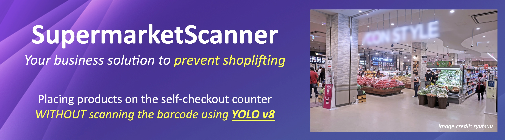
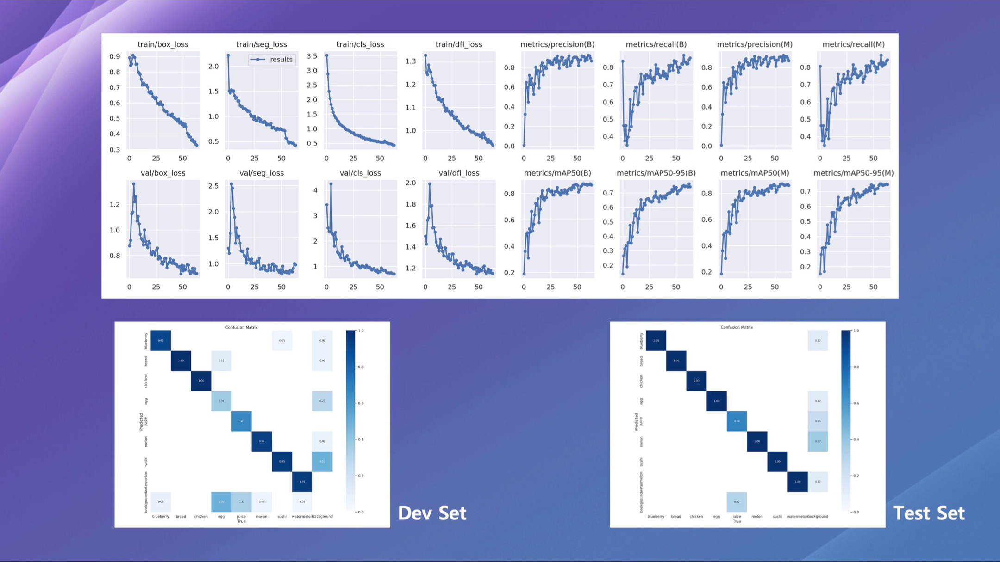
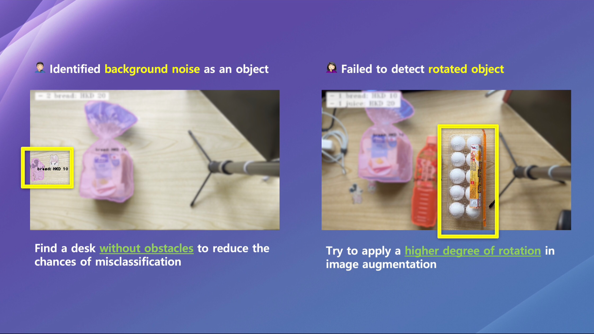
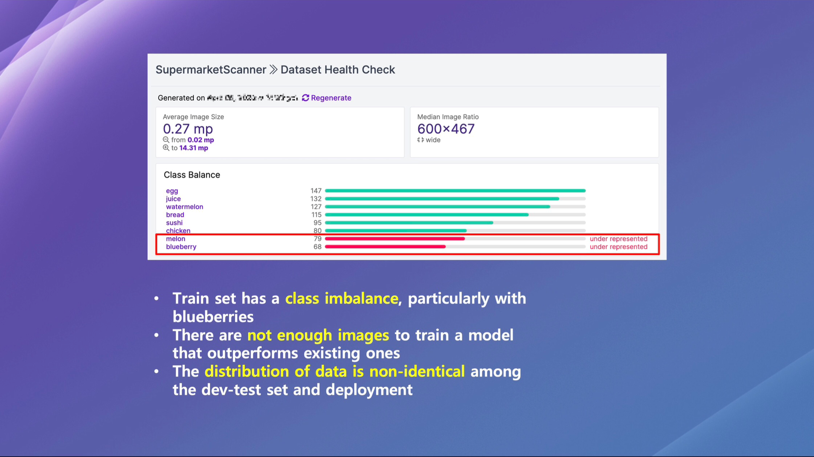
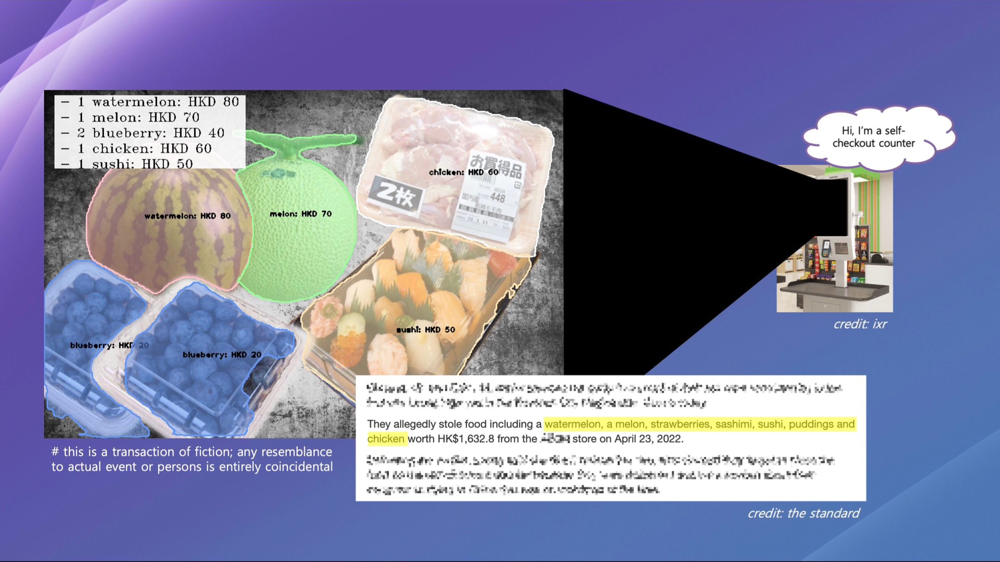

  

In early April, two doctors were found guilty of stealing food worth over HKD 1,600 from the Purple Label supermarket in Hong Kong, according to [The Standard](https://www.thestandard.com.hk/breaking-news/section/4/202373/Two-top-doctors-each-fined-HK$5,000-for-stealing-food-from-AEON-in-Whampoa) (2023). Although they claimed to have forgotten to scan the items on the self-checkout counter due to being distracted, their selective scanning behavior revealed otherwise, leading the magistrate to reject their claim. Unfortunately, retail theft involving self-checkouts has been a prevalent issue for retailers, causing them significant financial losses.

To address this problem, we propose an innovative solution called _SupermarketScanner_. This technology can scan all items placed on the self-checkout counter, automatically recognising the sales amount and total units of the basket, thereby making the checkout process more convenient for customers. More importantly, SupermarketScanner can help retailers prevent future incidents of theft by strengthening their self-checkout systems and ensuring that customers scan all products before completing their purchase.

## Table of Contents
- [1 - Objective](#1)
- [2 - Data Source](#2)
- [3 - Model Performance](#3)
- [4 - Get Ready Your Goods](#4)
    - [4.1 - One Good Per Transaction](#4.1)
    - [4.2 - Multiple Goods Per Transaction](#4.2)
- [5 - Error Analysis](#5)
- [6 - Discussion](#6)

## Objective: Simplifying Checkout and Preventing Shoplifting
SupermarketScanner is an AI plug-in that recognises supermarket goods at the self-checkout counter. It was inspired by [BakeryScanner](https://www.a-1bakery.com.hk/zh_hk/promotions/Bakery_scanner) and designed to be fast, accurate, and efficient because it is powered by You Only Look Once (YOLO) v8, a state-of-the-art model developed by [Ultralytics](https://github.com/ultralytics/ultralytics).

With SupermarketScanner, all you need to do is place your items on the self-checkout counter, and its AI-enabled camera will detect each item and display its price along with a transaction summary, eliminating the need to scan barcodes manually. As a customer, this simplifies the checkout process and saves time. As a retailer, it prevents incidents where customers forget to scan products and claim distractions.

Say goodbye to long lines and hello to hassle-free checkout with SupermarketScanner, your ultimate shopping companion.

  

## Data Source: Training SupermarketScanner with Transfer Learning
Our project involves using YOLO v8, which includes a pre-trained model on the COCO dataset. However, this model is not relevant to our needs. We need to gather images ourselves by searching online and apply transfer learning to our supermarket product recognition system. As a proof of concept (POC), we selected eight common items - blueberry, bread, chicken, egg, juice, melon, sushi, and watermelon - and acquired 55 images per category.

To label these product images, we utilised [Roboflow](https://universe.roboflow.com/jack-chan-edpdi/supermarketscanner) for an efficient solution. Although there is no fixed number of images needed per category, 55 falls short of training our model to perform at its best. Therefore, we augmented our training set with various image transformations, increasing the number of training examples threefold.

  

## Model Performance: Achieving Exceptional Accuracy and Reliability for Self-Checkout Counter
After training our model with supermarket images at default settings, it achieved impressive results of 87.2% mAP50 (mean average precision at IOU 0.5) on the dev set and 93.4% on the test set. Our comparison of models trained on images without augmentation showed that the current version outperformed its counterpart, which had less training data. Notably, we observed that the majority of entries in the confusion matrix fell into the diagonal for both the dev and test sets, further supporting the high performance of our trained model.

  

Following an extensive evaluation of our model's performance, we manually tested it on a set of 48 images. Remarkably, our analysis revealed that the model made accurate predictions on 94% of these images, highlighting its exceptional accuracy and reliability. Consequently, we have decided to use this robust model to power our SupermarketScanner operating at the self-checkout counter. We are confident that its remarkable performance will enhance customer experience and streamline the checkout process.

  

## Get Your Goods Ready: Testing SupermarketScanner on Our Desk
It was time to put SupermarketScanner to the test at the self-checkout counter. We selected a range of products for testing - blueberries, bread, eggs, juice, and sushi - having been trained with eight classes, and arranged them on the desk.

### One Good Per Transaction
We were immediately impressed by SupermarketScanner's swift identification of each item, accurately displaying its price and transaction summary without delay. Nevertheless, our confidence in the YOLO model faltered somewhat as it struggled to recognise the blueberries during checkout.

  

### Multiple Goods Per Transaction
SupermarketScanner's ability to recognise and process multiple items at once is crucial for modern supermarkets. Our tests showed that SupermarketScanner can detect various products very robustly, even those with similar shapes or packaging. It can quickly and seamlessly process multiple items, reducing wait times and improving customer satisfaction.

  

SupermarketScanner is a promising tool that has the potential to revolutionise retail operations. However, our rigorous testing has revealed some areas that need improvement before its implementation. Specifically, SupermarketScanner struggles with identifying certain products accurately, as evidenced by its inability to detect blueberries in some transactions. This could result in significant financial losses for retailers. Moreover, the tool falters when it comes to labeling items correctly at different angles and dealing with overlapping items. As such, these problems need urgent attention to ensure that SupermarketScanner functions effectively once implemented. Failure to address these issues could lead to significant financial losses for retailers. Therefore, it is crucial to rectify them before deploying the tool in a production environment.

  

## Error Analysis: Learning from Mistakes in Experimentation
As part of the experiment iteration for SupermarketScanner, several issues were identified during this trial. The following problems (and proposed solutions) were among the most notable:

1. At times, SupermarketScanner misclassifies **background noise** as an object.
  - Solution: Remove obstructions from the background or locate a table with a single-color background.

2. SupermarketScanner's performance is suboptimal when it encounters **rotated items**.
  -  Solution: Apply image augmentation to the training set to ensure that the model is better equipped to handle varied orientations.

  

3. A **class imbalance** causes SupermarketScanner to fail in accurately identifying certain classes.
    - Solution: Gather more images from underrepresented classes to achieve a balanced data distribution.

4. There are **insufficient images** available for training a more effective model.
    - Solution: Source more images through web scraping and by capturing pictures at the self-checkout counter. Carefully choose the images to ensure they are relevant and representative of the target population, and refrain from introducing any biases to the model.

5. The data distribution is not identical across train-test and deploy sets, resulting in a **non-identical data distribution**.
    - Solution: Obtain images from the self-checkout counter and organize them into a dev-test set. Verify that the dev-test set accurately reflects the real test environment (self-checkout counter), and evaluate the model on multiple test sets to ensure generalizability.

  

## Discussion: Final Thoughts on SupermarketScanner
SupermarketScanner is a data science project that uses cutting-edge technologies, such as YOLO v8, to address the problem of retail theft at self-checkout counters. While this project serves as a POC, it is worth noting that the YOLO model we trained for this purpose is not suitable for use in a production environment.

Our aim is to showcase a solution to the problem, but **can SupermarketScanner really address the issue?** As a former worker and customer at the Red Label supermarket in Hong Kong, I believe it is _not feasible_. Unlike BakeryScanner, which has only around 200 SKUs ([The Standard](https://www.thestandard.com.hk/breaking-news/section/4/195048/A-1-Bakery-announces-technological-breakthroughs-for-the-benefit-of-customers), 2022), most supermarkets have thousands of thousands items. The time and cost required to train the model and implement an AI camera system could be significant. Additionally, our experience with BakeryScanner at their shops shows that there are many issues, such as misclassification of background noise and types of bread. However, these can still be corrected manually by cashiers. On the other hand, SupermarketScanner is a self-service machine. Therefore, if the system misrecognises an item, it could lead to financial or reputational losses for the supermarket.

So, **is SupermarketScanner entirely useless?** _Not quite_. It is possible to use SupermarketScanner as a back-end system to double-check whether customers have scanned all their items before completing their transactions, helping supermarkets prevent self-checkout thefts. For example, if a pair of customers forgets to scan items valued at over HKD 1,600, SupermarketScanner can alert security or staff to investigate further. Although SupermarketScanner may not streamline the checkout process, it can help prevent incidents of shoplifting from happening again.

  

## License
This project is licensed under the MIT License. See the [LICENSE](./LICENSE) file for details.
