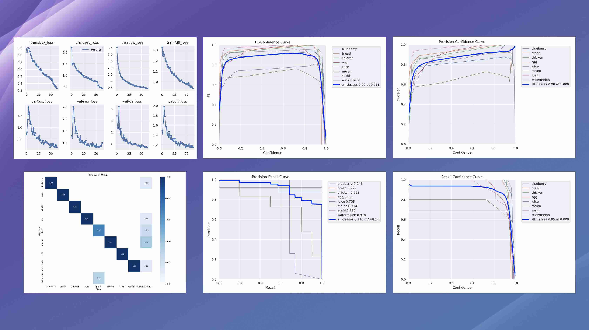
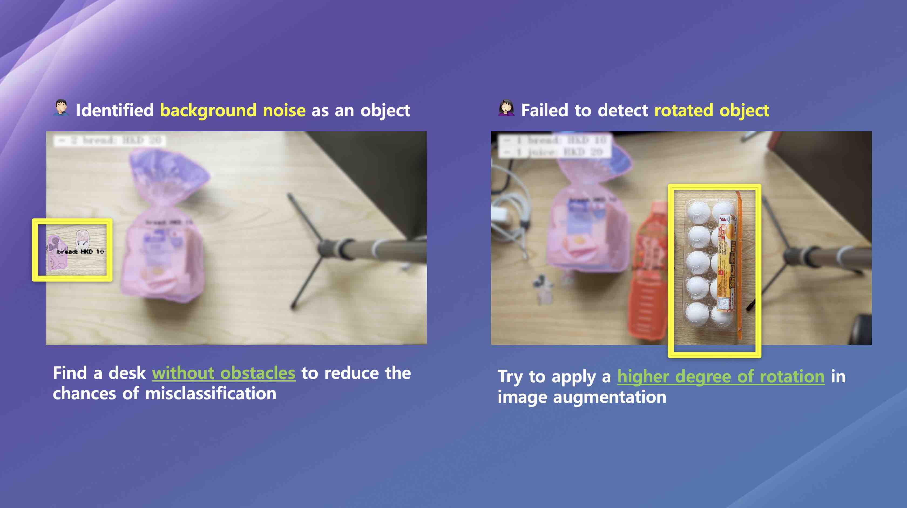
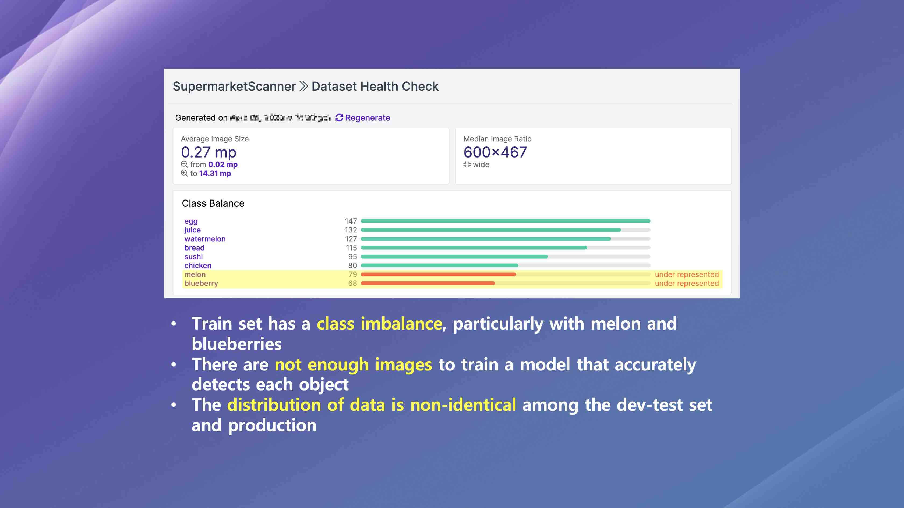
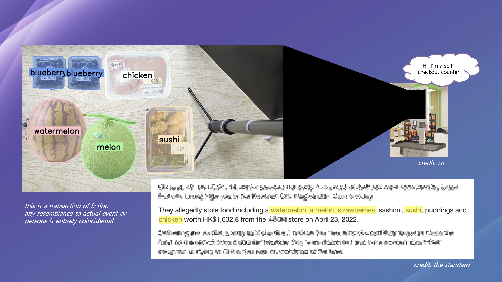

<!-- INTRODUCTION -->
# 🛒 SupermarketScanner
In early April 2023, two doctors were found guilty of stealing food valued at over HKD 1,600 from a supermarket in Hong Kong ([The Standard](https://www.thestandard.com.hk/breaking-news/section/4/202373/Two-top-doctors-each-fined-HK$5,000-for-stealing-food-from-AEON-in-Whampoa), 2023). Although they claimed to have forgotten to scan the items at the self-checkout due to distractions, their selective scanning behaviour suggested otherwise, leading the magistrate to dismiss their defence. Unfortunately, retail theft involving self-checkouts has become a pervasive issue for retailers, resulting in significant financial losses.

To address this problem, we built SupermarketScanner, an innovative solution designed to streamline the checkout process. This system scans all items placed on the self-checkout counter, automatically recognising the sale price and the total number of items in the basket. This not only improves the shopping experience for customers but also helps retailers prevent future theft incidents by ensuring that all products are accounted for before customers leave the store.

  

  
  
  
<strong>First Published:</strong> 17 April 2023 <strong>Last Updated:</strong> 28 June 2026

<!-- ROADMAP -->
## Table of Contents
- [1 - Why We Built SupermarketScanner](#1)
- [2 - Teaching the AI Counter](#2)
- [3 - Evaluating the Performance](#3)
- [4 - Time for a Field Test](#4)
    - [4.1 - Single Item per Transaction](#4.1)
    - [4.2 - Multiple Items per Transaction](#4.2)
- [5 - Tackling Real-World Limitations](#5)
- [6 - Fine-Tuning with Real Data](#6)
- [7 - Reflections on Feasibility](#7)

<!-- SECTION 1 -->

## Why We Built SupermarketScanner
SupermarketScanner is an AI-driven system integrated into the self-checkout counter, designed to recognise products placed on the counter. Inspired by [BakeryScanner](https://www.a-1bakery.com.hk/en/news/detail.html?CMS_FRONT_INFO_ID=344), it is engineered to be fast, accurate, and efficient, utilising a You Only Look Once (YOLO) model.

With SupermarketScanner, you simply place your items on the counter, and the system automatically detects the products, displaying their prices and a transaction summary. This eliminates the need for manual barcode scanning, saving valuable time for customers. For retailers, it helps plug the gap where customers might conveniently "forget" to scan items.

Bid farewell to long queues and embrace a hassle-free checkout with SupermarketScanner, your ultimate shopping companion.

  

<!-- SECTION 2 -->

## Teaching the AI Counter
This project employs a pre-trained YOLO v8 model fine-tuned on the COCO dataset. However, this model is not directly applicable to our specific domain. To address this limitation, we gathered our own images by searching online and applied transfer learning to enhance our supermarket product recognition system. As a proof of concept (PoC) project, we selected eight common items: blueberries, bread, chicken, eggs, juice, melon, sushi, and watermelon, collecting 55 images for each item.

To label these images, we utilised [Roboflow](https://universe.roboflow.com/jack-chan-edpdi/supermarketscanner), which provides a user-friendly interface. Due to the limited number of images, it is challenging to train a robust model that can accurately detect items. Therefore, we applied data augmentation using various image transformations, effectively tripling the number of training examples.

  

<!-- SECTION 3 -->

## Evaluating the Performance
Behind the scenes, we experimented with multiple methods to train the model. We discovered that models trained with augmented images generally outperformed those without. Our final model achieved impressive results, with 87% mAP50 (mean average precision at IoU 0.5) on the development (dev) set and 93% on the test set. The evaluation graphs below show promising signs of its potential in real-world applications. We could not wait to see how it performs at the self-checkout counter.

  

<!-- SECTION 4 -->

## Time for a Field Test
It is time to put SupermarketScanner to the test. We selected a range of products: blueberries, bread, eggs, juice, and sushi. These items were arranged on a desk to simulate the checkout process.

### Single Item per Transaction
We were immediately impressed by SupermarketScanner's swift recognition of each item, accurately displaying its price and transaction summary without delay. However, our confidence was momentarily shaken when the YOLO model struggled to recognise the blueberries during checkout.

  

### Multiple Items per Transaction
The ability to process multiple items simultaneously is crucial for our application. SupermarketScanner effectively demonstrated its capacity to detect a variety of products, even those with similar shapes or packaging. It seamlessly processed multiple items, proving its potential to reduce wait times and enhance customer satisfaction.

  

However, things are not as perfect as they seem. Another set of transactions revealed areas for improvement. For instance, the system struggled to identify products positioned at different angles or those obscured by other items. This highlights the need to enhance the model before introducing it to businesses.

  

<!-- SECTION 5 -->

## Tackling Real-World Limitations
As part of the iterative process, several problems were identified during our trials. Below, we highlight key issues and propose solutions.

1. **Misclassification of Background Noise**: At times, the system misclassifies background noise as an object.
    - Solution: Remove obstructions from the background or select a counter with a single-colour background to minimise distractions.

2. **Failure Related to Rotated Items**: The model's performance suffers when encountering rotated items.
    - Solution: Implement a higher degree of rotation during image augmentation to ensure the model is better equipped to handle varying orientations.

  

3. **Class Imbalance**: An imbalance in training data leads to the model's inability to accurately identify certain classes.
    - Solution: Collect additional images for underrepresented classes to achieve a more balanced distribution.

4. **Insufficient Training Images**: There are not enough images available to train a robust model.
    - Solution: Source more images via web scraping and by capturing real transactions at the self-checkout counter. It is vital to carefully select these images to ensure they represent the target population without introducing bias.

5. **Non-Identical Data Distribution**: The data distribution is not uniform across the train, dev, and test sets.
    - Solution: Acquire images directly from the self-checkout counter and curate a representative dev-test set. Verify that this set reflects the real environment and evaluate the model across multiple test sets to ensure generalisability.

  

By addressing these issues, we can enhance the effectiveness of SupermarketScanner and ensure its successful implementation in a retail environment.

<!-- SECTION 6 -->

## Fine-Tuning with Real Data
SupermarketScanner was initially trained using online images, which differ significantly from our specific use case. To enhance its accuracy, we needed to incorporate images captured directly from the self-checkout counter. We sacrificed transactions involving single products, as showcased earlier, and manually synthesised additional images with various rotations to fine-tune the YOLO model. The remaining six transaction samples were then used to evaluate the overall model performance.

We are excited about the results, the fine-tuned model significantly outperforms the initial version. As shown below, it can now correctly identify blueberries and eggs, which the initial model failed to detect. However, the system still struggles with overlapping items. This limitation arises because we did not expose the model to such scenarios during training. This highlights a clear area for future improvement.

  

<!-- SECTION 7 -->

## Reflections on Feasibility
SupermarketScanner leverages technology to address the real-world problem of retail theft. While this project serves as a PoC, the YOLO model we trained is not yet ready for deployment in a production environment.

Our aim is to demonstrate a potential solution, but can SupermarketScanner truly solve the problem? As a former employee at the Red Label supermarket in Hong Kong, I believe a fully automated vision-checkout may not be entirely feasible for a large grocery store. Unlike BakeryScanner, which only handles around 200 SKUs ([The Standard](https://www.thestandard.com.hk/breaking-news/section/4/195048/A-1-Bakery-announces-technological-breakthroughs-for-the-benefit-of-customers), 2022), most supermarkets stock thousands of items. The time and cost required to annotate data and manage an AI camera system could be astronomical. Moreover, if the system misrecognises an item, it could lead to false alarms and upset customers.

So, is SupermarketScanner entirely useless? Not quite. It has huge potential as a back-end system to verify that customers have scanned all their items before completing their transaction. For example, if a customer forgets to scan items valued at over HKD 1,600, SupermarketScanner can silently alert staff to investigate further. Although it may not fully replace manual barcode scanning, it can still play a vital role behind the scenes in mitigating shoplifting.

  

<!-- DISCLAIMER -->
---

**This was created as a personal hobby project and learning exercise.**
